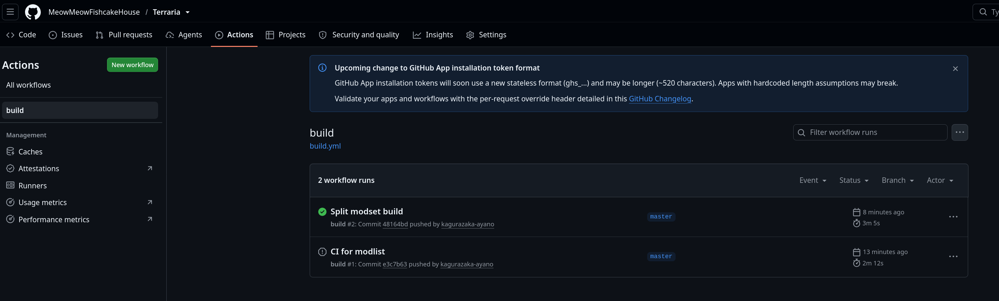
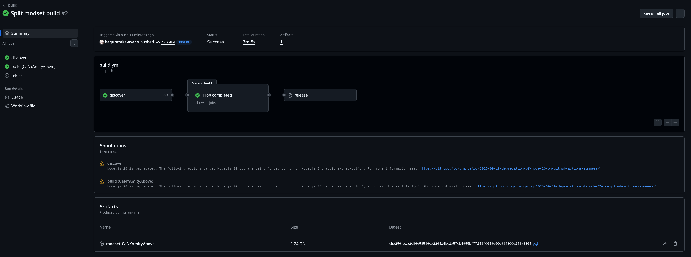

# Terraria

This repo contains modsets used for my terraria server.

## Getting modset

Navigate to [github action output](https://github.com/MeowMeowFishcakeHouse/Terraria/actions/workflows/build.yml) and pick the CI job there.

Under the "Artifacts" tab there are compressed mod archive for each modset:

